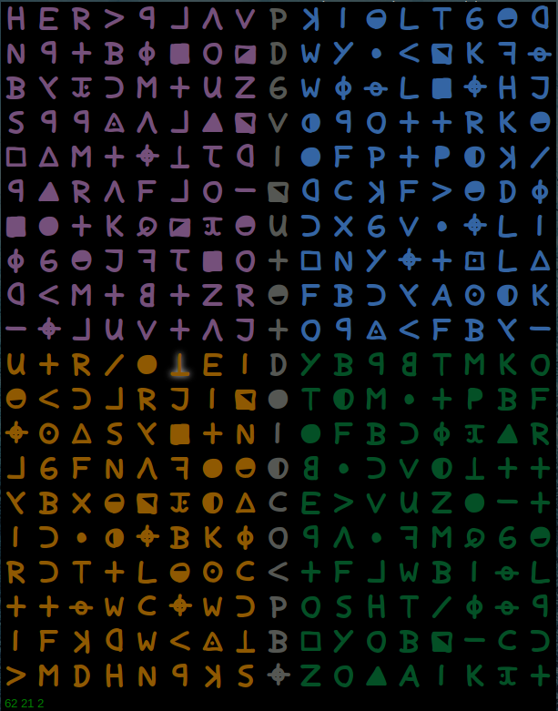

Z
=
Z is Raku app to visualize the unsolved z340 cipher and perform different operations (Transpose, Rotate, Flip ...) in attempt to have better understanding of the cipher.



Overview
=======
The main cipher window consist of the cipher symbols, with each transposition, the grams count ( uni-grams, bi-grams, tri-grams, ... and so on, if any ) will be printed to the status bar.

If you are familiar with `vi`, working with `Z` should be easy, as `Z` mimics some of `vi` commands. like visual mode for selection , copy/paste, replace (or decipher symbol). Mouse works as well.

Transformation can be applied to the whole cipher or a selection of the cipher, Full list of transpositions can be found on the Examples section  [here](https://github.com/hythm7/Grid/blob/master/README.md) 

`Z` is a visualising tool, it's not a bruteforce tool. Once you are happy with a transpositions you can save it and use other tools to bruteforc it.


Installation and Running
=======================

Z is a GTK+ app, requires [P6-GtkPlus](https://github.com/Xliff/p6-GtkPlus.git), Since `P6-GtkPlus` is not in the ecosystem yet, Please follow the build instructions mentioned in the above link.

After installing `P6-GtkPlus`, clone Z repo:
```
git clone https://github.com/hythm7/Z.git

cd Z

# installl dependencies using zef
zef install --deps-only .
# or using pakku
pakku verbose info add deps only .

````

Install `resources/Zodiac.ttf` font if you want the symbols to show as the actual cipher symbols, rather than ascii symbols

```
# Installing a font on Linux box is similar to below:
mkdir -p  ~/.local/share/fonts
cp resources/Zodiac.ttf !$
fc-cache -f -v
```
Run `Z` as instructed by `P6-GtkPlus`:

```
MVM_SPESH_INLINE_DISABLE=1 $P6_GTK_HOME/p6-GtkPlus/p6gtkexec bin/z
# the SPESH env variable is a temporary workaround for a current issue
```
Once app is running a File Chooser window will show where you can choose the cipher file path `cipher/z340` (or `cipher/test` if you want to experiment first) 


Commands
========


* `v` Activate / Deactivate `visual` mode (selection using `hjkl`)
* `y` Yank selected symbols
* `p` Paste yanked symbols
* `d` Decipher current symbol (Replace it with another letter (hopefully to compose a meaningful word)
* `f` Flip horizontally
* `F` Flip Vertically
* `r` Rotate clockwise
* `R` Rotate anticlockwise
* `m` Mirror clockwise     [ Experimental ]
* `M` Mirror anticlockwise [ Experimental ]
* `a` Angle +90            [ Experimental ]
* `A` Angle -90            [ Experimental ]
* `g` Calculate grams and print to statusbar
* `G` Calculate grams of selection and print to statusbar
* `1` Select unigrams
* `2` Select bigrams
* `3` Select trigrams
* `4` Select quadgrams
* `5` Select quintgrams
* `6` Select 6-grams
* `7` Select 7-grams
* `8` Select 8-grams
* `9` Select 9-grams
* `c` Open color box and apply chosen color to selection
* `n` Open a new cipher with same state of current cipher
* `N` Open a new cipher with same state of selection in current cipher
* `Q` Close current cipher window
* `Hit Space on a selected symbol` Select all similar symbols and print count to status bar
* `Return` Deactivate `visual` mode 
* `Esc` Unselect all and deactivate `visual` mode 
* `Right click -> save` Save current cipher state to a file
* `Right click -> quit` Close current cipher window


License
=======

`Artistic-2.0`.

If you solved the `z340` cipher with help of `Z`, Please mention `Z` ;-) 


Credits
=======

Thanks to [Xliff](https://github.com/Xliff) for being more than helpfull with addressing the issues I faced during working with `Z`, I literally started this project knowing nothing about `GTK`, I wouldn't be able to make `Z` up and running without his help.

Thanks to the nice people on `#raku` irc channel

The Zodiac.ttf font was downloaded from [here](http://www.zodiackillerciphers.com)
